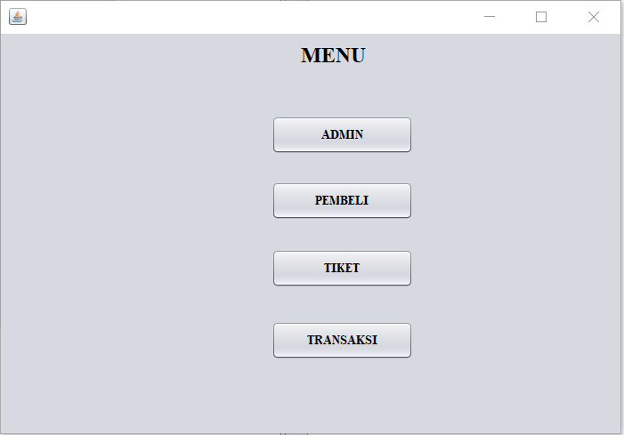
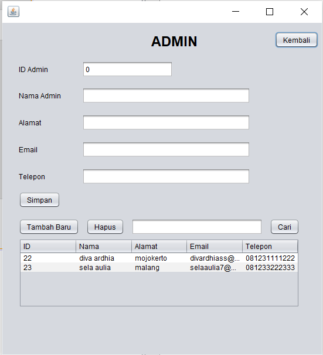
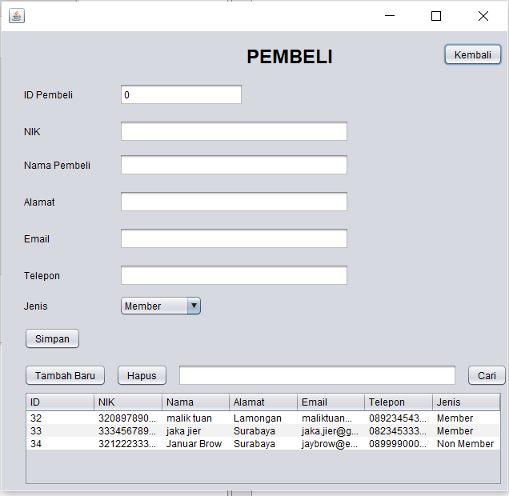
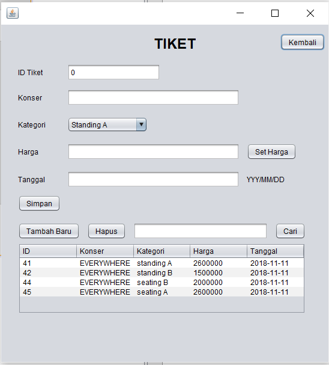
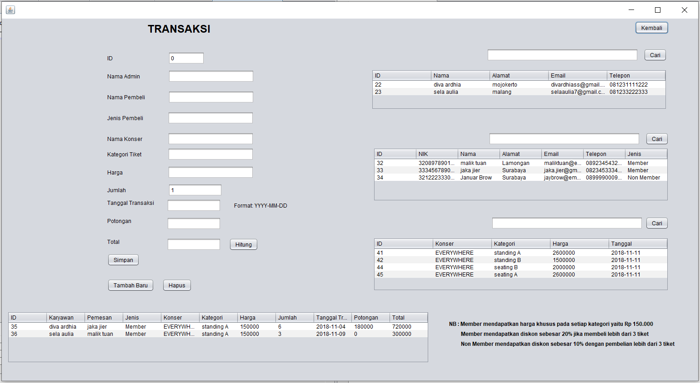

# Laporan Final Project

## Studi Kasus

Sebuah Program e-commerce penjualan tiket konser bertajuk EVERYWHERE. terdapat tabel database terdiri dari admin, pembeli, tiket, dan transaksi. abstrak class Pengguna memiliki sub class admin dan pembeli yang memuat beberapa atribut seperti nama, alamat, email, dan telepon dan method yang sama diturunkan dari class pengguna. 
terdapat interface class IPembayaran yang mengimplement pembeli dan terdapat class member dan nonmember untuk mengatur jenis pembayaran yg dilakukan pembeli sehingga class member dan nonmember menjadi subclass class pembeli. pada class tiket terdapat atribut kategori dimana ada 4 kategori yang masing-masing kategorinya memiliki posisi duduk dan harga yang berbeda sebagai berikut:
- Standing A : Rp 1.750.000, 00
- Standing B : Rp 1.500.000, 00
- Seating A  : Rp 2.600.000, 00
- Seating B  : Rp 2.000.000, 00

tabel transaksi berhubungan dengan tabel admin, pembeli, dan tiket sehingga terdapat has a- atau aggregation pada class transaksi yang has a- class admin, pembeli, dan tiket. aturan transaksi yaitu : 
- pembeli jenis member diberikan harga Rp 1.500.000, 00 apapun kategorinya mendapatkan diskon 20% untuk pembelian tiket lebih dari 3
- pembeli jenis non member mendapatkan diskon 10% untuk pembelian tiket lebih dari 3

## Diagram uml

## relasi database

## GUI

- menu

- admin

- pembeli

- tiket

- transaksi

