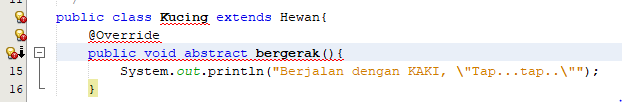
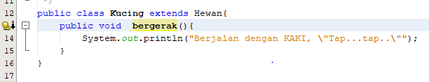
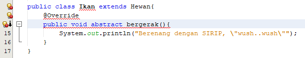

# Jawaban Pertanyaan Jobsheet Pertemuan 10

1. Penjelasan terkait tentang jalannya program pada pertemuan 10 ini adalah dikarenakan class Hewan adalah class abtract maka tidak memiliki isi, dengan begitu dari class Hewan akan mengambil isi dari class lainnya yaitu dari class Kucing, Ikan, dan Orang yang telah ditambahkan extends Hewan didalam classnya sehingga isi dari class dapat di ambil. Kemudian akan dimunculkan pada class Program yang dalam pemrograman ini adalah sebagai Main class. Sehingga akan muncul suatu output seperti berikut ini:

2. 
Seperti pada gambar di atas yang terjadi apabila method bergerak() pada subclass ditambahkan abstract maka akan terjadi eror. Hal tersebut dikarenakan method bergerak() pada classHewan sudah berbentuk abstract class, sehingga apabila dalam class ditambahkan abstrack maka akan double sehingga eror.
3. 
Pada gambar di atas adalah setelah dilakukan menghapus override pada subclass maka terjadi eror, tidak muncul tanda merah seperti pada yang ada di nomor 2. Namun disitu muncul tanda kuning yang berisi tentang menambahkan override pada method bergerak() dikarenakan apabila override diapus tidak ada rujukan untuk abstraknya sendiri yang ada pada class Hewan.
4. 
Hasilnya akan eror seperti pada pertanyaan nomor 2 dikarenakan program menanyakan lumba-lumba didalam class ikan karena ditambahkan abstak didalam sana jadi isi dari method tidak terbaca.